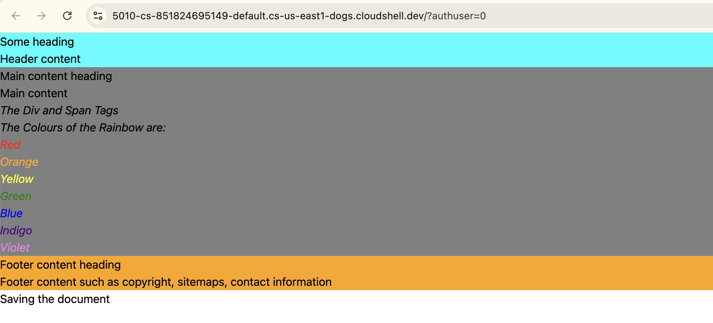
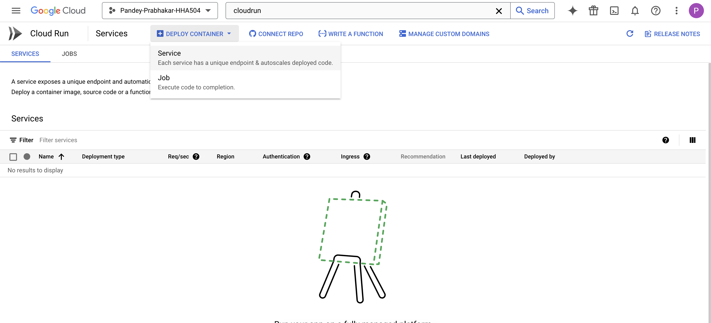
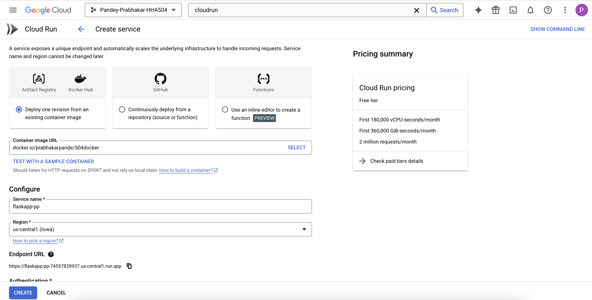
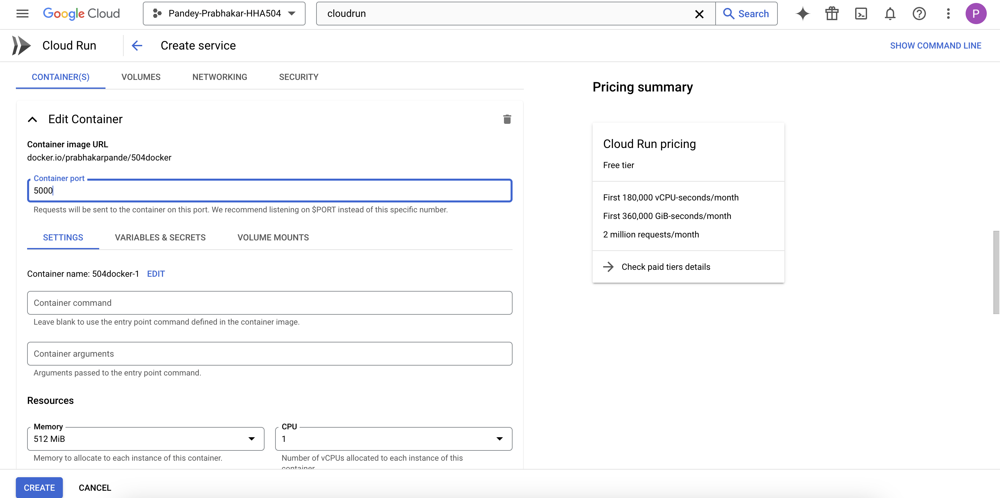
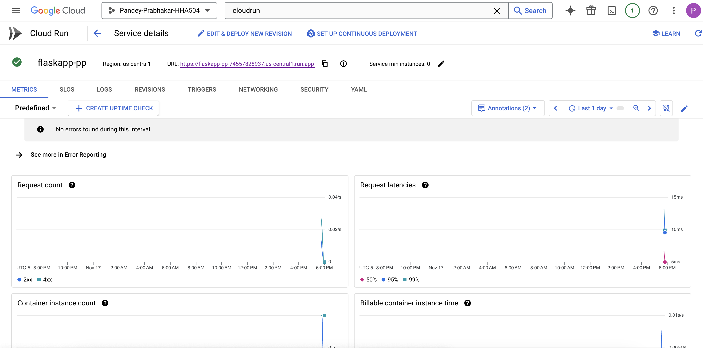
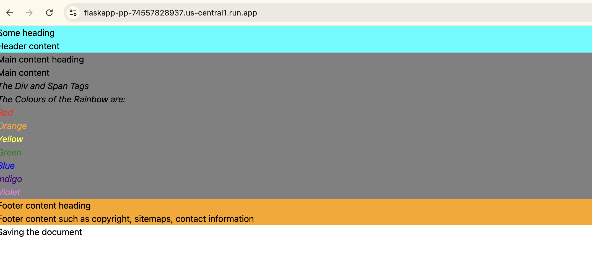

# HHA504_assignment_containers

## Link to the deployed app
https://flaskapp-pp-74557828937.us-central1.run.app

## Reflection

Deploying docker in GCP was fairly straightforward. I didn't run into any issues. I inserted some simple HTML code to customize the flask app. I was a little confused when I had changed the port number during web preview in Cloudshell but I was still able to launch it on the original port and the changed one. 